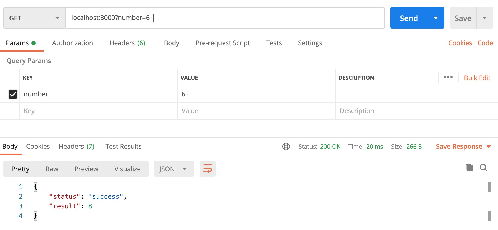
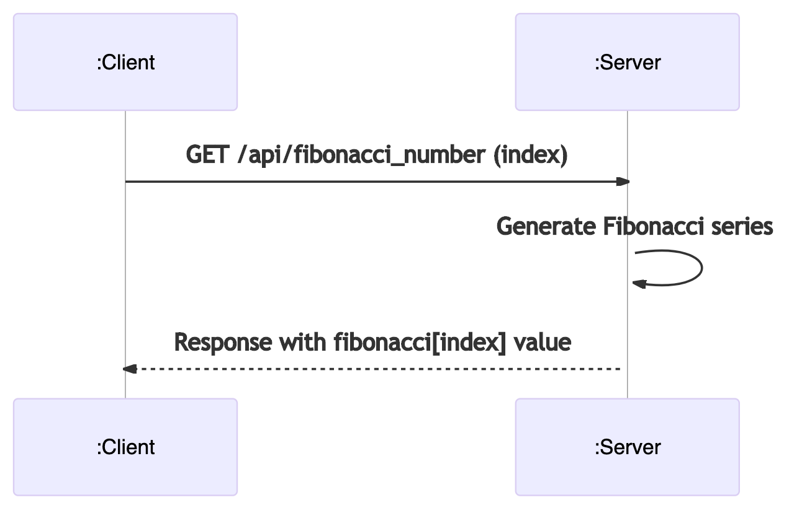

# Fibonacci REST API

The Fibonacci REST API has only one single feature:

- Given an index `n`, the API will reply with the value of the `n` position of the Fibonacci series. Example: if `n=3` response should be `2`, if `n=6` response should be `8`.

## Objective

This repository will be used to versioning the code of the solution but also as a journal or notebook about the process followed to implement the solution.

## Try it locally

Pre-reqs:

- node.js

#### Steps:

1. Clone this repo

   ```bash
   git clone https://github.com/rastangineer/fibonacci-rest-api.git
   cd fibonacci-rest-api
   ```

2. Install packages

   ```bash
   npm install
   ```

3. start server locally

   ```bash
   node app.js
   ```

4. Send requests with Postman or a similar

   

## Initial challenges

1. I don't consider myself a `REST API` developer, or even a developer.
   - But I have plenty of experience working with middleware, HTTP, SOAP and REST protocols. I used to be a **Java** developer long time ago.
2. What programming **language** to use?
   - From previous personal projects I can say I'm more familiar with `node.js` and I read that `express.js` is a web framework for node.js that allows you create to REST APIs quickly. So the winner is **node.js + express.js**
3. I'm familiar with `REST API` services, `SOAP/HTML` Web Services and similar technologies, but should I start with **design** or just start googling and try?

   - Definitively YES, that would help to **identify** the modules/functions needed.

     

   <!-- ```mermaid
   sequenceDiagram
   participant C as :Client
   participant S as :Server
   
   C ->>+ S: GET /api/fibonacci_number (index)
   S ->>+ S: Generate Fibonacci series
   S -->>+ C: Response with fibonacci[index] value

   ```-->

   ```

4. How do I **start** with something basic?
   - I like to start with the very basics, and then gradually add funcionality in a iterative and **incremental** way. Since I'm new developing REST APIs I would start with the most basic thing, the famous **Hello World**, for example an API that just replies with the text `Hello World`.
   - Next step would be passing something like the `username` using **parameters** and reply with something like `Hello World username`.
   - Now that we are able to pass and read parameters, we can start thinking about how to generate the Fibonacci series, from what I remember from college this is a very good use case for **recursive programming**.
5. Thought process?
6. Technical decisions?
   - What is the maximun index `n` allowed.
     - In theory, it shouldn't have a limit. So it's important to be able to handle big values for `n`.
   - Harcoded Fibonacci series? Or Fibonacci series generated on each request.
7. Optimizations
   - After initial tests with `recursive programming` I have found that this a very time consuming method, the bigger the parameter the longer it takes to generate the fibonacci series.
   - Alternative 1:
     - Using the _golden ratio_ `phi ^ n / sqrt(5)` where `phi = (1+ sqrt(5)) / 2` we might get better performance, but values might not be accurate after `n > 77`. [Reference](https://stackoverflow.com/a/42952842)
   - Alternative 2:
     - Using a while loop, by using the formula `f(n) = f(n-1) + f(n-2)` where `f(0) = 0` and `f(1) = 1`
   - Alternative 3:
     - How about hard-coding the fibonacci series and store it in an array, then just reply with `array[n]`, no calculations. Just saying I haven't really thought about it.
